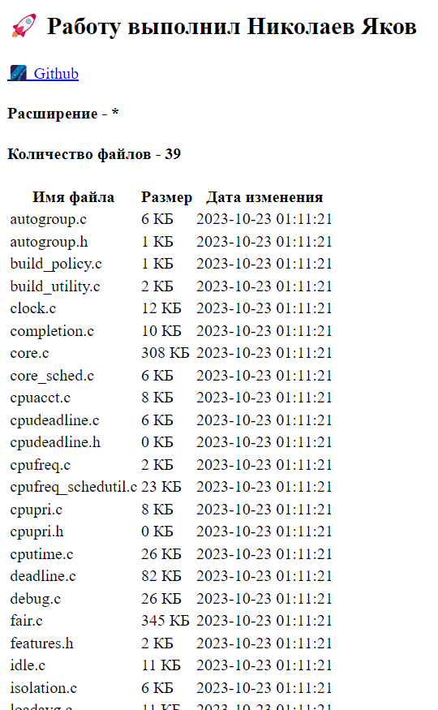

## Поставленная задача
> У вас имеется [ZIP-архив](https://github.com/Family-Team-2/golang-test/raw/main/test.zip) (MIME: `application/zip`), в котором содержится несколько произвольных файлов.
> От коллеги вам поступил запрос на написание веб-сервиса, который выводил бы список файлов _с определенным расширением_ в этом ZIP-архиве на веб-страницу
> Для этого необходимо написать программу, которая:
> 1. откроет ZIP-архив и получит список содержащихся в нем файлов
> 2. создаст HTTP-сервер на произвольном порту;
> 3. при входящем запросе на HTTP-сервер программа должна отобразить список файлов.

**Требования:**
1. ✅ Golang (версия >= 1.21);
2. ✅ Для HTTP-сервера используется фреймворк Chi: [https://github.com/go-chi/chi](https://github.com/go-chi/chi);
3. ✅ Путь к ZIP-файлу и расширение файлов в ZIP-архиве передаются в качестве параметров командной строки при запуске программы;
4. ✅ Программа должна реагировать на Ctrl+C (сигнал SIGINT для Linux, SIGTERM для Windows). Если у программы не открыто никаких ресурсов, которые следует завершить, то будет достаточно, чтобы при получении Ctrl+C просто выводилось сообщение о том, что программа завершает работу.
5. ✅ При выдаче файла программа должна логировать событие в stdout командной строки. Для логирования можно использовать любой **структурированный** логгер, например, log/slog ([https://pkg.go.dev/log/slog](https://pkg.go.dev/log/slog)), или zap ([https://github.com/uber-go/zap](https://github.com/uber-go/zap)).
## Результат
Текущее решение отображает:
1. **Указанное расширение**
2. **Кол-во найденных файлов с указанным расширением**
3. Информация о файлах в виде списка с тремя колонками:
	1. Имя
	2. Размер в КБ
	3. Дата последнего изменения

**Используемые технологии и практики:**
1. Роутер `chi/v5`
2. Логгер `slog`
3. `archive/zip`
4. **Clean Code**
5. **gracefully shutdown**



## Инструкция
### Важно
Единственное требование для успешного запуска программы - **запускать его рядом с папкой `ui`**, где содержаться шаблон главной страницы для шаблонизатора. Изначально планировалось содержимое папки `ui` встроить в программу в двоичном представлении с помощью стандартного пакет `embed`, но времени чуть не хватило (*понять и простить🙏*).
### Доступные аргументы
Программе требуется только путь до zip-архива в качестве аргумента, в таком случае приложение отобразит **все файлы** из архива на порту`:8080` - это значения по умолчанию:

```bash
go run ./cmd/main.go <path-to-zip>

go run ./cmd/main.go test.zip
```

Чтобы указать необходимый порт, требуется указать параметр `-p` или `--port` и затем порт:

```bash
go run ./cmd/main.go -p <port> <path-to-zip>
go run ./cmd/main.go --port <port> <path-to-zip>

go run ./cmd/main.go -p 80 test.zip
```

Чтобы отобразить определенное расширение из архива, следует указать параметр `-e` или `--ext` и затем расширение, можно указать с точкой, можно без:

```bash
go run ./cmd/main.go -e <ext> <path-to-zip>
go run ./cmd/main.go --ext <port> <path-to-zip>

go run ./cmd/main.go -e .go test.zip
```

Также предусмотрено явное указание пути с помощью параметра `--path`:

```bash
go run ./cmd/main.go --path <path-to-zip>

go run ./cmd/main.go --path test.zip
```
